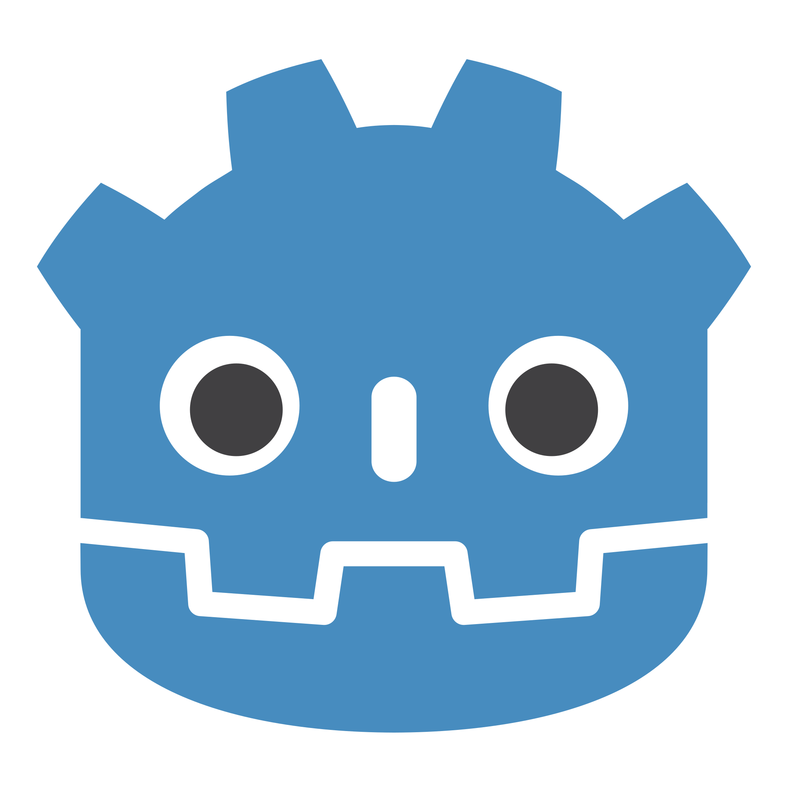
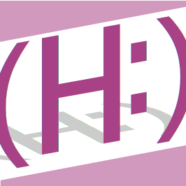
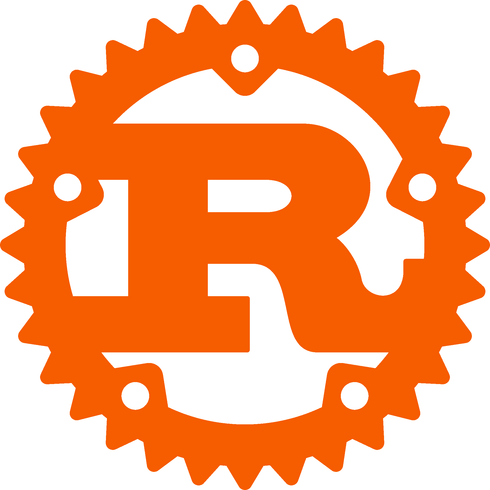

<h1 align="center">Cześć, z tej strony Szymon!</h1>
<h3 align="center">Polski i swojski chłop o zainteresowaniach programistyczno-artysycznych.</h3>

  

    
Nazywam się Szymon Marcin Pio Patalita i na chwilę obecną chodzę do technikum informatycznego na profil programisty.

    
Moimi zainteresowaniami są:

    <ol>
      <li>Programowanie aplikacji:</li>
      <ul>
        <li>internetowych,</li>
        <li>bazodanowych,</li>
        <li>komputerowych,</li>
        <li>moblinych,</li>
      </ul>
      <li>Grotwórstwo</li>
      <li>Grafika komputerowa,</li>
      <li>Modelowanie 3D,</li>
    </ol>
  

  

  

  

  

<h3 align="left">Inne sposoby komunikacji:</h3>

<h3 align="left">Znane mi języki i narzędzia:</h3>

                     

    

<!---->
